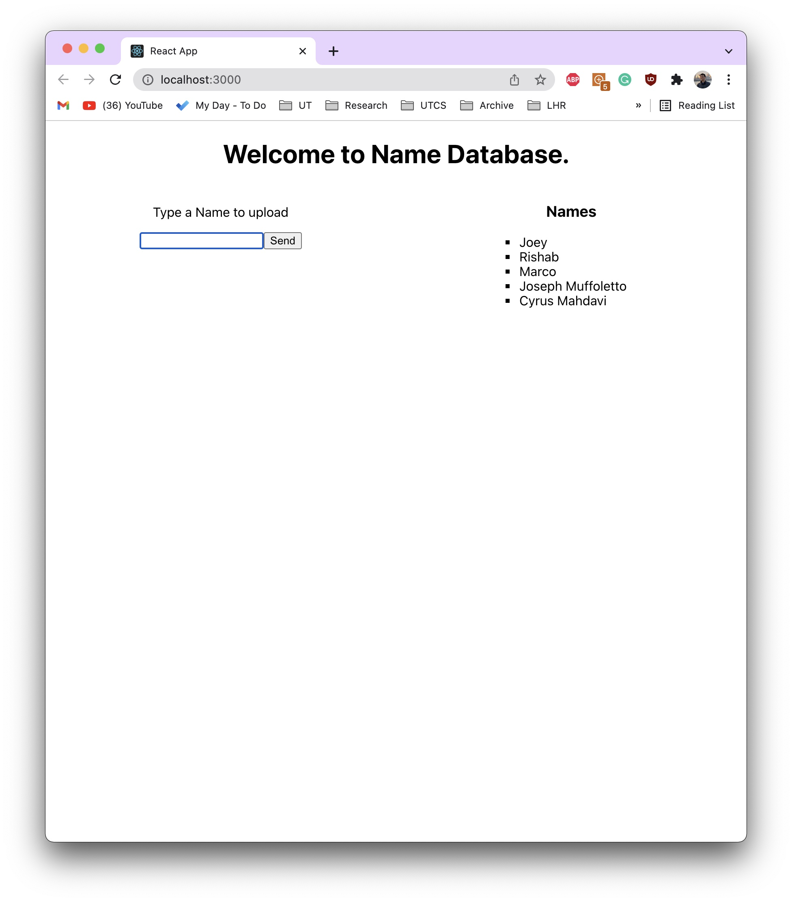

# New member software assessment for Longhorn Racing - Combustion

The purpose of this assessment is to vet and teach. It is not expected of you to know all of these concepts prior to applying, but rather we want to see if you have time and initiative to complete the task. 

## Contents

- [The Task](#the-task)
- [Frontend](#frontend)
- [Backend](#backend)
- [Database](#database)
- [Submission](#submission)

### The Task

You will be creating a small, full-stack web application that allows users to send, store, and display a list of names. Your application should include all of the features shown in the image below:

<figure>

<figcaption align = "center"><b>Sample Finished Assessment</b></figcaption>
</figure>

To meet these requirements, you will need a frontend, a backend, and a database. Specifically, the names will be entered through the frontend, transported by the backend, and permantently stored in the database. **The displayed names should NOT be lost if the page is refreshed or your browser's memory is cleared. As such, the names must be in a persistent local or cloud storage.**

More specifics can be found in the sections below.  

In general: please use React for the frontend, NodeJS for the backend, and MongoDB for the database. We recognize that there are many ways to complete this project, but we ask that you use these tools as they comprise our tech stack.

<!--  -->
### Frontend

The frontend for your application is loose in requirements. 
 1. It must be in React
 2. It must allow users to input and send strings
 3. It must allow users to see the history of all of their strings

Styling is completely up to you. As long as the above requirements are met, you may format everything as you'd like. 

<a name="headers"/>
### Backend

##### Your code must expose the following APIs

*The notation "{key: value}" indicates a key-value pair (e.g. {msg: "hello world"})*

1. **AddName**
   1. Type: POST
   2. Request Body
      1. {name: '*name*'}
   3. Success Response
      1. Status Code: 201
      2. {msg: "Successfully added '*name*' to database"}
   4. Failure Response
      1. Status Code: 400
      2. {err: error} <- *hint* use a try-catch block
2. **GetNames**
   1. Type: GET
   2. Request Body
      1. Empty
   3. Success Response
      1. Status Code: 200
      2. Body: {names: array of names}
   4. Failure Response
      1. Status Code: 400
      2. {err: error} <- *hint* use a try-catch block

**The APIs MUST be written using NodeJS, as it is the core technology of our backend.**

### Database

Your database must be hosted on MongoDB. While alternative methods exist, we at LHR appreciate the flexibility and ease of NoSQL databases. 

Creating a shared Mongo database is completely free. Simply create an account and create a database using MongoDB Atlas.

For connecting your node application with the Mongo database, We recommend that you use Mongoose (https://www.npmjs.com/package/mongoose). 

### Submission

Please make and share a Github repository containing all of the files necessary to run your completed web application. Best of luck!

*If there any issues or ambiguities in the instructions, please let us know and we will be happy to fix them*
